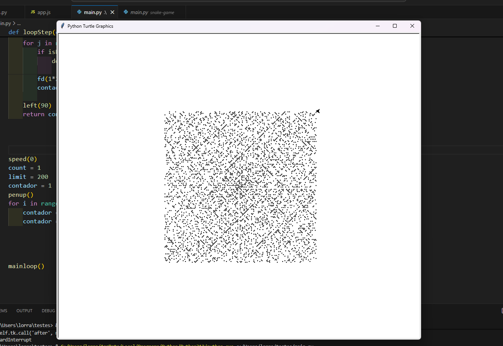
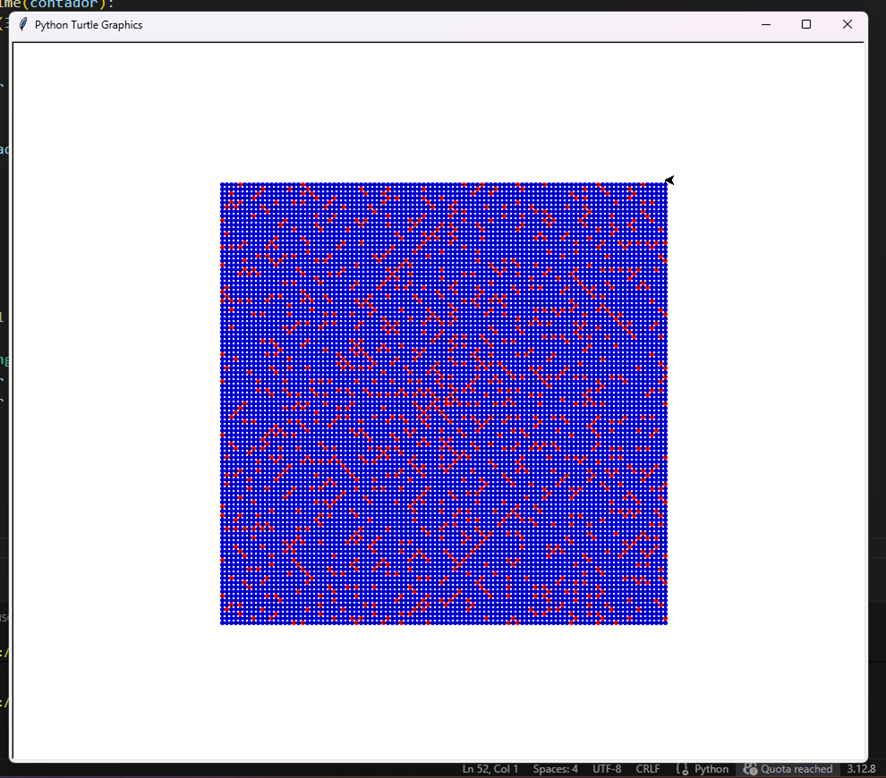

# Projeto Espiral de Ulam

> Objetivo: Desenvolvi este projeto com o propósito de aplicar o conhecimento que adiquiri sobre números primos. 

A ideia surgiu depois que resolvi o terceiro desafio do **Projeto Euler**, no site do **freeCodeCamp**. Este desafio requer que encontremos o maior fator primo de um dado número.

Na tentativa de por em **prática** o conhecimento aprendido descobri a **espiral de Ulam**, uma espiral onde a disposição dos número primos revela alguns padrões interessantes, especialmente no que se refere às diagonais. Tente uma obter uma imagem semelhante a que consta no artigo da [Wikipedia](https://pt.wikipedia.org/wiki/Espiral_de_Ulam) sobre o assunto.

## Tecnologias

A resolução original do exercício foi escrita na linguagem **JavaScript**. A aplicação prática, no entanto, foi feita com **Python** e o módulo **Turtle**.

## Capturas de Tela
### Desenho Monocromático

### Desenho Colorido

## Vídeo
[espiral_de_ulam.mp4](./videos/demonstracao.mp4)